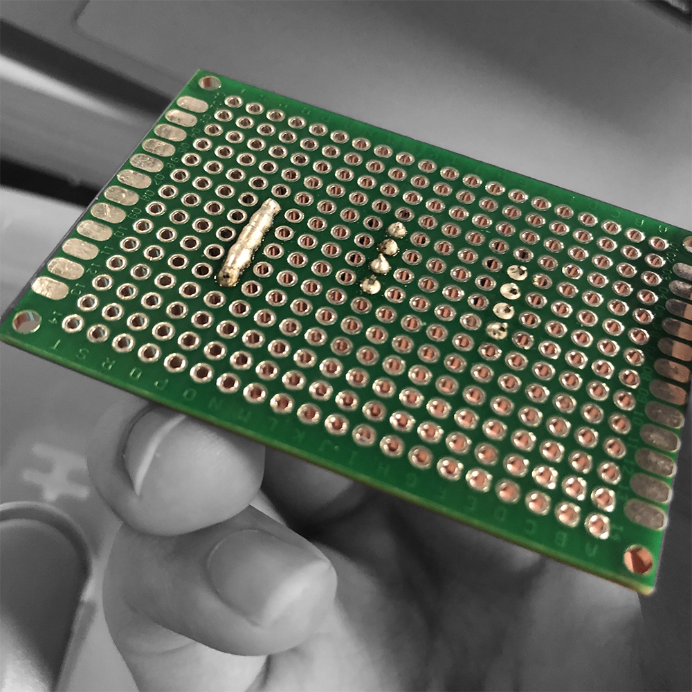

Baichuan Wu </br>
A15608204 </br>

# Lab1

## Introduction
  * Software Installation
  * EnVision Training & Soldering Practice
  * Python Tutorial
  * Arduino Basics
  * Github/Markdown Platform Setup

## Objective1a
  1. **Goal**: Install Anaconda / Python, Arduino IDE
  2. **Steps**:
    * Download all the software packages and install them


## Objective1b
  1. **Goal**: Solder 5 pins to the protoboard
  2. **Steps**:
    * Undergo solder training
    * Start solder machine, await heated
    * Carefully melt solder onto pins using solder pen
    * Get approved by TA
    * Take a picture of board
    * 

## Objective2
  1. **Goal**: Print "Hello World!" in Python
  2. **Steps**:
    * hello.py
      * ```touch hello.py```
      * ```vim hello.py```
      * Declare ```txt``` variable as "Hello World!"
      * ```print()``` the ```txt``` variable
    * hello2.py
      * Open Anaconda Navigator
      * Open Spyder
      * Create new file with default template
      * Declare ```txt``` variable as "Hello World!"
      * ```print()``` the ```txt``` variable

## Objective3
  1. **Goal**: Achieve basic I/O and controls on Arduino board
  2. **Steps**:
    * Create file
      * ```touch MyBlink.ino```
    * Define constants and global variables
      * ```const int onDurationSlow = 1500;```</br>
        ```const int onDurationFast = 200;```</br>
        ```const int defaultOnDuration = onDurationSlow;```</br>
        ```const int defaultOffDuration = 500;```</br>
        ```int onDuration = defaultOnDuration;```</br>
        ```int offDuration = defaultOffDuration;```</br>
        ```int counter;```</br>
    * Initialize pin configuration in ```setup()```
      * ```pinMode(LED_BUILTIN, OUTPUT);```
    * Initialize HardwareSerial in ```setup()```
      * ```Serial.begin(9600);```
    * Parse serial input using ```Serial.readStringUntil("/r")```
    * Make logical judgement using ```if...else``` statements
    * Execute commands using ```digitalWrite()``` and ```delay()```

## Objective4
  1. **Goal**: Setup Github repository
  2. **Steps**:
    * Setup git remote & local repositories
      * ```git init```
      * ```git add .```
      * ```git remote add origin https://github.com/user/repo.git```
      * ```git commit -m "first commit"```
      * ```git push -u origin master```

## Conclusion
  All objectives completed. IDE environment set up, solder practiced, first Arduino application created & tested, Github repository initialized.  
