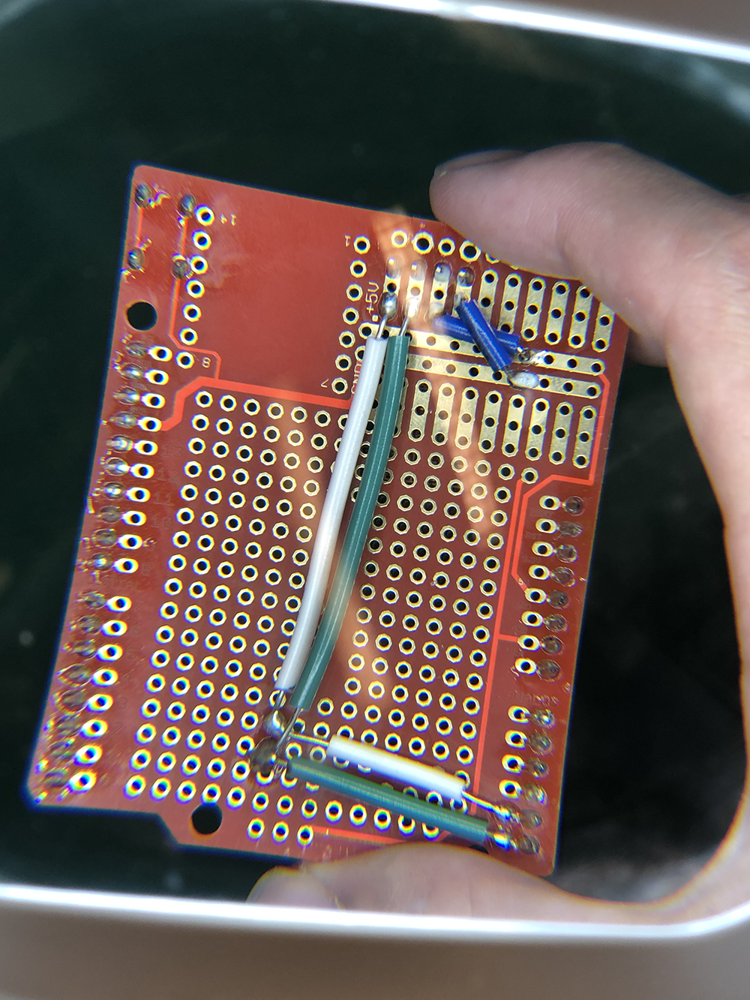

Baichuan Wu  
A15608204  

# Lab2

## Introduction
  * Testing AT commands
  * Communicating with BLE
  * Sending information to an OLED display
  * Using a button to create a stopwatch
  * Soldering: OLED and button

## Objective1
  1. **Goal**: Arduino to BLE, AT Commands
  2. **Steps**:
    * Assemble HM-10 module to Arduino on breadboard
    * Install `AltSoftSerial` dependencies in Arduino IDE
    * Setup data transfer route between `SoftSerial` and `AltSoftSerial` in the main `loop()`
    * Upload compiled code
    * Test `AT+` commands
    

## Objective2
  1. **Goal**: Communicate with other BLE devices
  2. **Steps**:
    * Switch self to peripheral / central mode using `AT+ROLEx` command
    * Query MAC address using `AT+ADDR?` command
    * Connect to other devices using specific MAC address using `AT+CONx` command
    * Set connection mode to immediate if necessary using `AT+IMMEx` command
    * Transfer data
    
    * Switch roles using `AT+ROLEx` and repeat aforementioned processes

## Objective3
  1. **Goal**: OLED Display Peripheral, I2C Protocol
  2. **Steps**:
    * Solder 4-header pins onto OLED panel
    * Attach OLED panel to the breadboard
    * Install `Wire` and `Adafruit` libraries
    * Setup text serial channel, styling in `setup()`
    * Whenever serial receives message, convert it to a `char[]` using `strcpy` to a designated `char[]*`
    * Pipe text using `display.write()` and `display.display()`
    * Clear display and reset cursor if necessary using `display.clearDisplay()` and `display.setCursor(0, 0)`
    
    * Actualize circuit on protoboard
    

## Objective4
  1. **Goal**: Button Input, Pull-up Circuits
  2. **Steps**:
    * Assemble pull-up circuit
      * Connect VCC, GND
      * Insert button
      * Connect digital pin 4 to one side of the button
      * Pull-up the other side with a resistor and short to the ground
    * Implement state reader function `checkButton()` and main logics in `loop()`
    * A video [demonstration link](https://drive.google.com/file/d/1GTPBXvcvTuJ1gdO6djioEvL4WEGv9sJM/view?usp=sharing)

## Conclusion
  All objectives completed. BLE wiring & programming successful, BLE communication achieved. OLED setup & programming completed.
