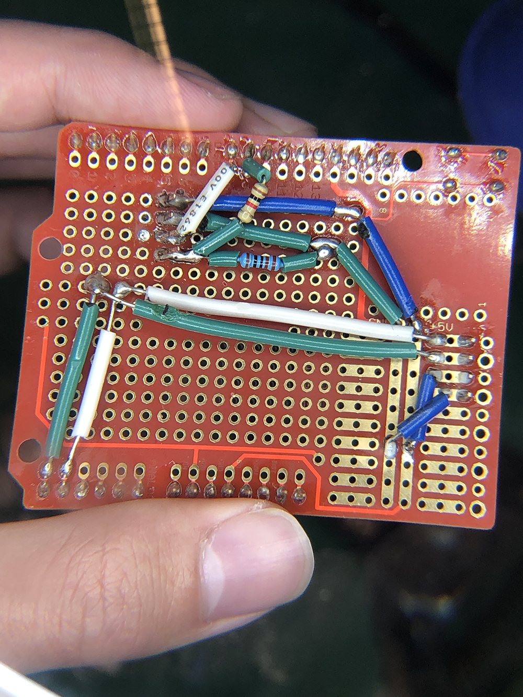

Baichuan Wu  
A15608204  

# Lab3

## Introduction
  * Testing AT commands
  * Communicating with BLE
  * Sending information to an OLED display
  * Using a button to create a stopwatch
  * Soldering: OLED and button

## Objective1
  1. **Goal**: Python Constructs
  2. **Steps**:
    * Complete individual python exercises on worksheet

## Objective2
  1. **Goal**: Python Serial Communication
  2. **Steps**:
    * Install PySerial library, serial port driver
    * Encapsulate `ser.read()` and `ser.write()` functions
    * Use aforementioned methods to test sending and receiving commands

## Objective3
  1. **Goal**: Use BLE to send information from the laptop to the Arduino
  2. **Steps**:
    * Solder BLE module onto proto-board
    
    * Code central device using python to establish a connection to peripheral BLE device
    * Code peripheral device using Arduino C++ to respond and display messages received
    * A video [demonstration link](https://drive.google.com/file/d/1rBOwpl85GLXj1qLT3tE2r7-S2Ot-eofo/view?usp=sharing)

## Objective4
  1. **Goal**: Button sleep/wake
  2. **Steps**:
    * Solder button onto protoboard
    * Code accordingly in Arduino C++
    * A video [demonstration link](https://drive.google.com/file/d/1F10SxF_j_xeQOZ0gsT2Gax18jnV05bzS/view?usp=sharing)

## Conclusion
  All objectives completed. Python environment and libraries set up completed, Arduino peripheral BLE device and laptop central BLE device connection successful, BLE sleep successful.
