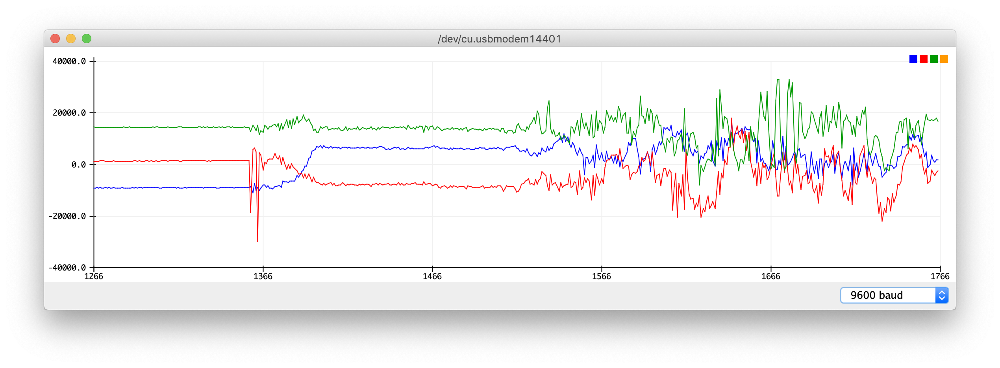

Baichuan Wu  
A15608204  

# Lab4

## Introduction
  * BLE Handshake
  * IMU Basics
  * Live Plotting
  * Saving and Replaying the data

## Objective1
  1. **Goal**: Update BLE handshake, Work with OO code
  2. **Steps**:
    * Update BLE handshake procedures based on starter code and instructions
    * Read stream procedure updated with termination character `;`

## Objective2
1. **Goal**: Reading raw values, Visualising motion
2. **Steps**:
  * Install designated Libraries
  * Solder and wire IMU unit onto Arduino
  * Sample and plot accelerometer data on serial plotter
  
  * Modify and update BLE protocols for sensor data transmission capabilities

## Objective3
1. **Goal**: Show the data visually on the Python side
2. **Steps**:
  * Install designated Libraries
  * Update starter code
  * A video [demonstration link](https://drive.google.com/open?id=1Ii9Safv5zGD4KTgGPkJDl1R2ztQWrsiv)

## Objective4
1. **Goal**: Save and playback data from a `.csv` sheet
2. **Steps**:
  * Save data using python I/O
  * Read data using python I/O
  * Live plot data

## Conclusion
BLE handshake updated, OO version Bt achieved, IMU data transmission achieved, Python visual plotting achieved
