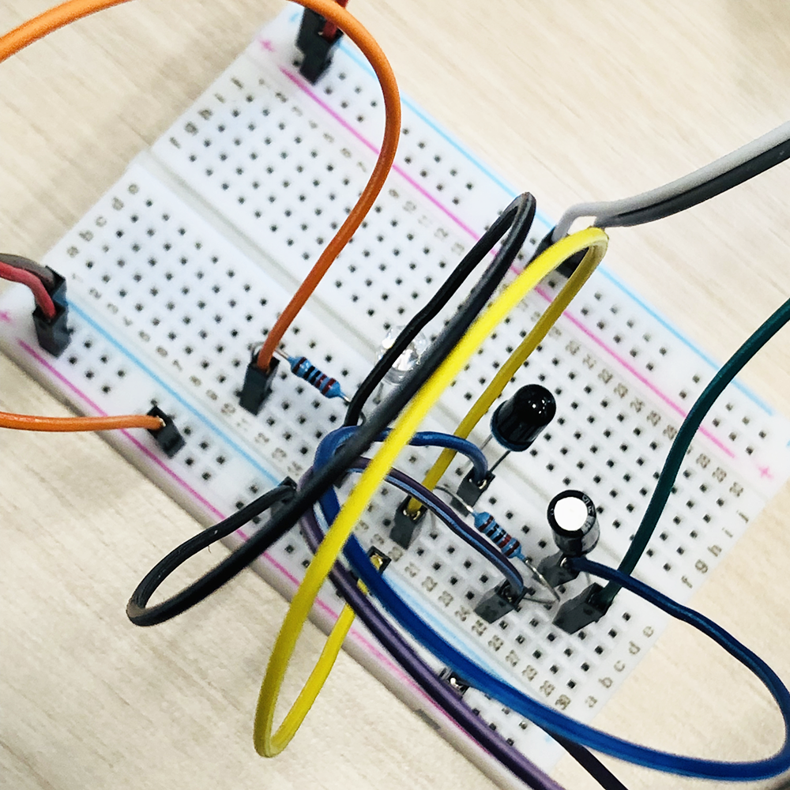
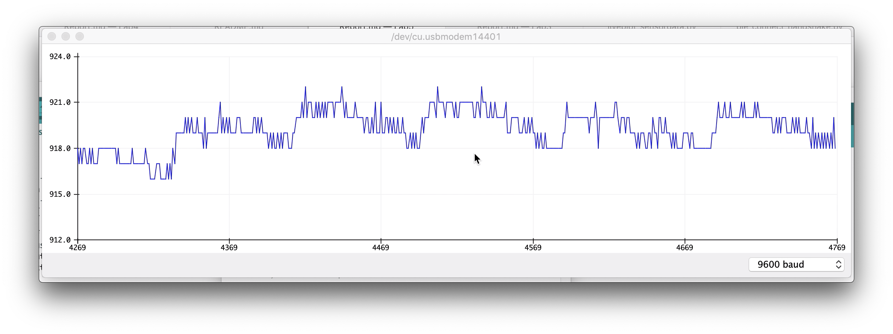
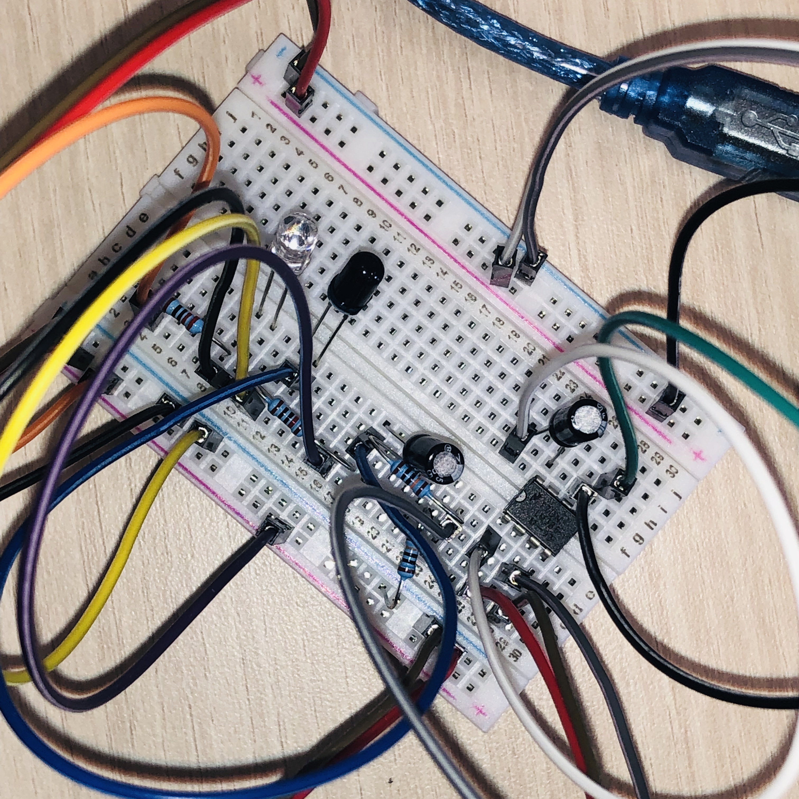
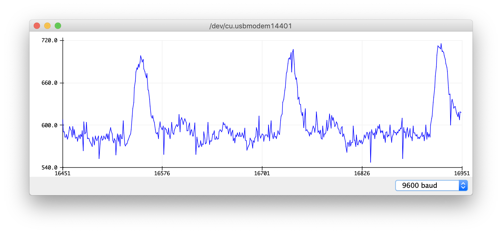
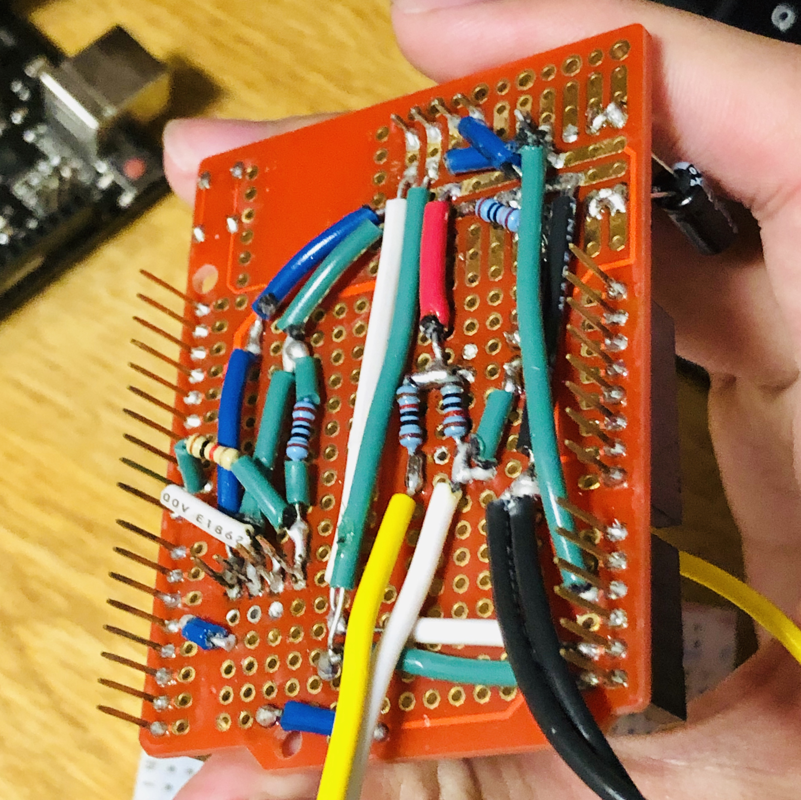
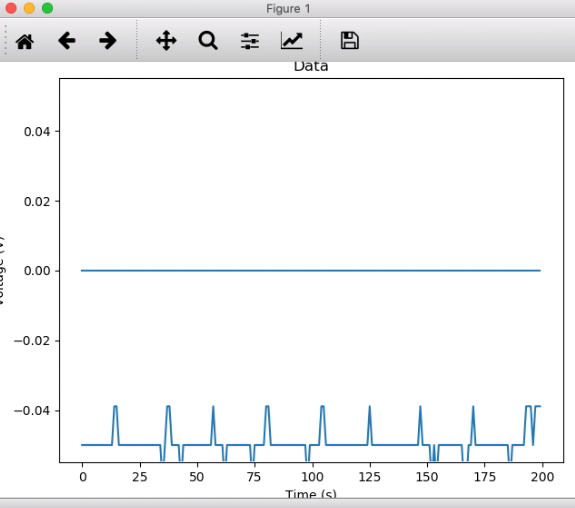
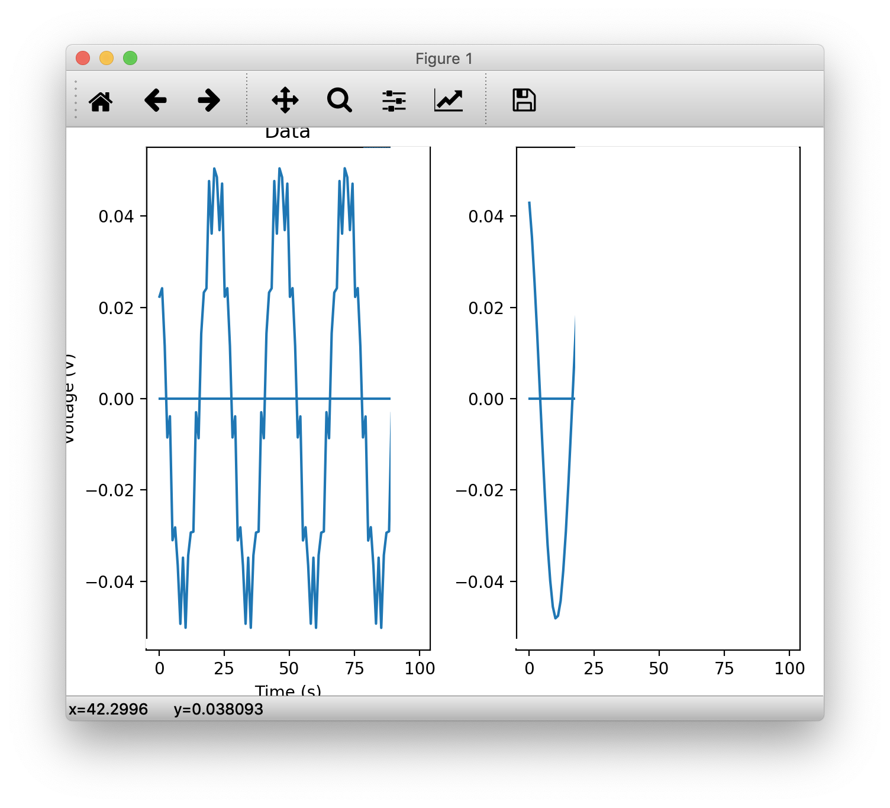
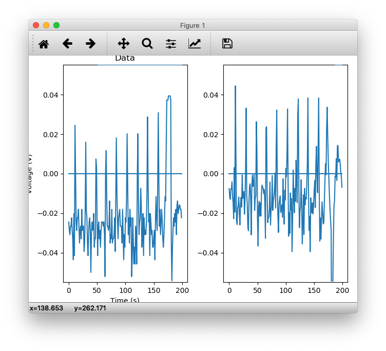

Baichuan Wu  
A15608204  

# Lab5

## Introduction
  * BLE Handshake
  * IMU Basics
  * Live Plotting
  * Saving and Replaying the data

## Objective1
  1. **Goal**: Voltage Divider, Analog Amplifier, Quantization
  2. **Steps**:
    * Assemble IR circuit
    
    * Transmit & plot sensor data onto serial plotter
    
    * **Observation**:
    Signal derived is heavily distorted and contains lot of noise, due to weak signal strength. But still a pattern can be observed, thus requires a denoise regression (quantization)
    * Upgrade circuit for better resolution
    
    
    

## Objective2
  1. **Goal**: Integrate with existing code base
  2. **Steps**:
    * Further assemble and solder circuit onto protoboard
    * Coding on both Arduino and python side to enable analog sensor data transmission capabilities
    
    * `.csv` file included in ./Images/

## Objective3
  1. **Goal**: Create Filter class
  2. **Steps**:
    * Wrap up OO filter class
    * Test using generated sinusoidal wave
    

## Objective4
  1. **Goal**: Filtering IR Data
  2. **Steps**:
    * Integrate filter OO and BLE data receiver
    * Test using 4.0Hz LPF;
    * Test using 0.5Hz HPF;
    
    * **Observation**:
    Signal after filtering is more "stable", that is, certain amount of noise is deduced
    * A video [demonstration link](https://drive.google.com/open?id=1IWU02d92BhD-B2wxqqFUxoPO08Ns6XtO)

## Conclusion
Circuit assembled, IR sampling working, data transmission & saving capabilities tested, filter initiation tested, actual filter application tested
