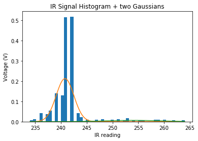
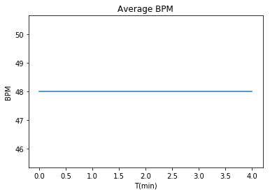

Baichuan Wu </br>
A15608204 </br>

# Lab6

## Introduction
This lab implements heart rate calculation using machine learning
  * Heartbeat Detection
  * Modular HR Class
  * Calculating Heart Rate (HR)

## Objective1
  1. **Goal**: Data Collection, Unsupervised Learning, Gaussian Mixture Models
  2. **Steps**:
    * Plot first 5 second of raw data using ```np.linspace()``` and list slicing syntax, results are: <br>
    
    * Plot the histogram of IR signal with 50 bins using ```plt.hist()```, results are: <br>
     <br>
    **Observation**:
    Histogram data strongly suggests that there exists a right-skewed gaussian distribution within our dataset. However, a "borderline" is required to further classify our data.
    * Calculate GM model, acquire corresponding parameters (average, standard deviation, weight) using ```gmm.fit()``` method, results are: <br>
     <br>
     <br>
    * Reshape both training and validation data to 2 dimensional array using ```np.array().reshape()```
    * Apply data label prediction to both training and validation data using ```.predict()```
    * Plot results with proper scaling:
     <br>
     <br>

## Objective2
  1. **Goal**: Create an ```HR_calc``` class, Add training ability,  Add labeling ability
  2. **Steps**:
    * Wrap up methods to acquire GMM parameters, train model, and label prediction using Python Objective Oriented Coding
    * Create private method to normalize input data to label them on a more intuitive scale
    * GMM parameter and trained results are:
    <br>
     <br>
     <br>
    * Data are labeled correctly

## Objective3
  1. **Goal**: Heuristics in ML
  2. **Steps**:
    * Acquire GMM ```predict()``` of input data
    * Calculate average timespan of each heartbeat sample
    * Eliminate outlier samples that have outlying 2-sigma sample span
    * Calculate instantaneous bpm using ```beats / minute```
    * Yield result
    * Plots are: <br>
     <br>

## Conclusion
We've gained substantial knowledge on data processing using machine learning throughout this lab. We've learned how to create a Gaussian Mixture Model upon dataset and apply
