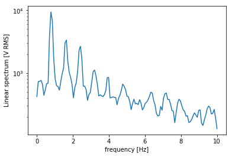
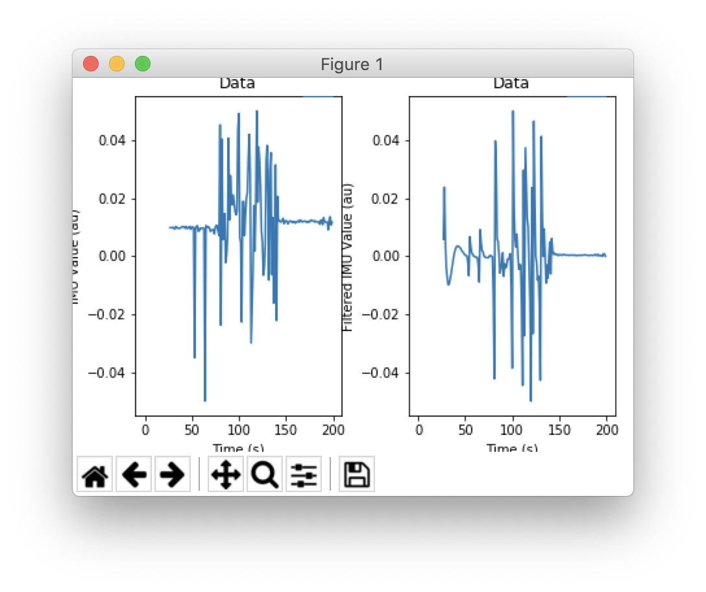
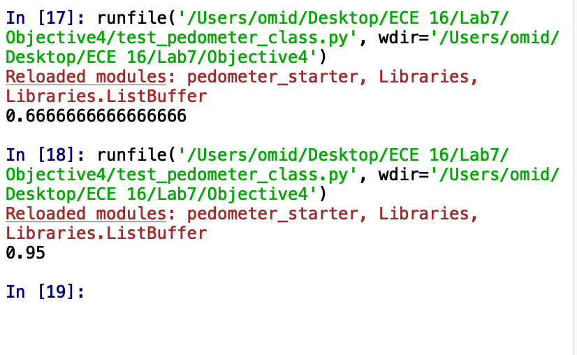

Baichuan Wu </br>
A15608204 </br>

# Lab7

## Introduction
This lab integrates previous labs and appends IMU data handling capabilities

## Objective1
  1. **Goal**: Heart rate system integration
  2. **Steps**:
    * Modify and integrate ```hr_heuristics()``` method
      * Count timespan for beats
      * Average the timespan
      * Neglect outlier beats that have significantly smaller (greater then 2 standard deviation) timespan to its neighbors
      * Calculate and return bpm
    * Transmit data using BLE from Arduino, filter data
    * Live plot on Python
    * A video [demonstration link](https://drive.google.com/open?id=1rv5xHq3PWrQ1v9nz5AHxNYwvESO6w5ux)

## Objective2
  1. **Goal**: Experimenting with the IMU
  2. **Steps**:
    * Modify Arduino and python code to enable data transmission capabilities
    * Process and live plot IMU data on python
    

## Objective3
  1. **Goal**: L1 Norm and LPF
  2. **Steps**:
    * Calculate L1 normalization on Arduino for ```ax```, ```ay```, ```az```
    * Apply filter on python
    * Save active and nicht active data for training
    

## Objective4
  1. **Goal**: Supervised Learning, KNN
  2. **Steps**:
    * Implement ```extract_features()``` to reshape and pre-process data
    * Train model based on active & non-active feature sets using ```KNN()``` model
    * Validate model using validation portion of data
    * Accuracy is:
    

## Conclusion
Objectives completed, HR BPM recognition implemented, IMU data comm and processing fulfilled, pedometer KNN model traning tested.
